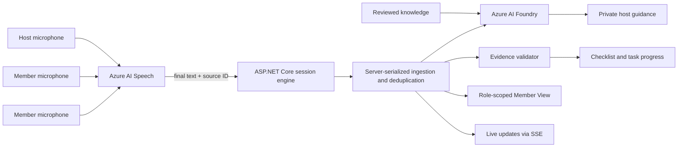

# LiveSense

<p align="center">
  <strong>Close the understanding gap. LIVE.</strong><br>
  Private guidance for the presenter, clear explanations for participants, and proof of what was covered—while the conversation can still change.
</p>

<p align="center">
  <a href="https://csa-meeting-coach-demo.westus2.cloudapp.azure.com"><strong>Try the live demo</strong></a>
  ·
  <a href="#how-it-works">How it works</a>
  ·
  <a href="https://innovation-studio.microsoft.com/events/hackathon2026/submissions/projects/proj-97c305f2-45ac-4529-ba3e-756b29da8715">Hackathon project</a>
  ·
  <a href="docs/engineering-reference.md">Engineering reference</a>
</p>

> **Naming:** LiveSense was previously called Session Copilot. The repository,
> source namespaces and some demo assets retain their existing technical names.
>
> **Hackathon status:** LiveSense is currently a standalone web application.
> A Teams meeting side-panel and media-bot path are included as experimental
> integration work, but the live demo does not claim native Teams transcript access.

## The most valuable moment to help is before the conversation ends.

A customer mentions a constraint. A support engineer misses the next diagnostic question. A participant hears a term they do not understand—and says nothing.

A transcript can preserve those moments. A summary can describe them later. **LiveSense is designed to help while there is still time to change the outcome.**

## THE GAP: captured words are not shared understanding

Presenters must listen, explain, ask the right questions and track progress at the same time. Participants bring different levels of knowledge. The result can be a gap between what was said, what was understood and what still needs discussing.

LiveSense connects **what is being said + the session goal + reference knowledge + discussion progress** to build live context. It turns that context into different help for each side—not the same answer broadcast to everyone.

## The LIVE difference: one conversation, two experiences

**For the Host:** private suggestions on what to ask, clarify, explain or discuss next, grounded in the conversation and available knowledge.

**For Members:** timely definitions and contextual tips that make the discussion easier to follow, with session-wide familiarity settings and publication controls. Private Host coaching stays out of the Member view.

**For the plan:** the Host can accept a suggestion as a trackable discussion item. It completes automatically only when later transcript evidence supports it, with an exact quote and independent validation. Accepting a suggestion is not the same as covering it.

**The wow moment:** a gap becomes visible, the Host gets a useful next move, and participants get the context they need—all before the meeting becomes follow-up work.

## Where this can help

These are illustrative use cases, not claims of completed customer deployments.

- **Technical support:** “It started after the certificate change.” The Host can receive a suggestion to clarify the change and the exact error using the approved runbook; the customer can receive an explanation of an unfamiliar term. The goal is a clearer diagnostic conversation—not an automatic fix.
- **CSA / solution design:** “Admins have permanent access, and leavers are removed manually.” With relevant Entra knowledge, the Host can receive a suggestion to explore privileged access and offboarding, while the customer receives explanations of the concepts being discussed.
- **Customer onboarding:** “We bought it, but the team still does not know how to use it.” The Host can be prompted to uncover a practical adoption gap and explain the relevant workflow; participants receive context matched to their familiarity.
- **Training and workshops:** learners need explanations while the instructor needs to spot what deserves another example. LiveSense separates those needs instead of interrupting everyone with presenter guidance.
- **Beyond technology:** in a cooking session, “Our guests are vegan, but the recipe uses butter and honey” can prompt the Host to explain substitutions from the uploaded guide. The same conversation pattern applies to different knowledge domains.

## SCALE: extend expertise, not just meeting notes

The opportunity is to bring useful, knowledge-grounded support to more conversations without requiring a subject-matter expert beside every presenter. A shared interaction model can be adapted through session goals, reference documents, familiarity settings and templates—not a separate experience for every topic.

Start with a support runbook. Extend to a CSA knowledge pack, an onboarding guide or a training manual. **One live-context approach. Multiple roles. Multiple domains.**

This is a path to broader adoption, not a claim of proven infrastructure scale. The current hackathon MVP uses a single Azure VM and local session storage. Enterprise identity, tenant isolation, transactional storage, capacity testing and operational controls are work ahead of a broader rollout.

## Built and demonstrated—not presented as production-certified

The standalone web prototype combines Azure AI Speech, Azure AI Foundry and an ASP.NET Core session engine, with separate Host and Member views and live updates. AI analysis runs asynchronously; suggestions depend on available evidence and knowledge, not every spoken sentence. Local rules support selected scenarios and are not a universal intent detector.

Microphones are explicitly activated with participant notice and consent. The application does not persist raw audio. Local session data is scheduled for deletion after 24 hours; cloud-service logs and retention require separate assessment. Security, privacy and compliance approval are prerequisites for a real-data pilot. Native Teams integration is future work.

## What success would look like

A pilot should measure fewer missed questions, better participant understanding, more evidence-backed discussion coverage and less post-meeting clarification. These are outcomes to validate—not measured savings or a claimed 50% reduction.

**Help shape the pilot:** bring a repeatable conversation, a reviewed knowledge pack and a way to measure the gap today.

**LiveSense: make the next moment of the conversation better.**

## Experience at a glance

| Host experience | Member experience |
|---|---|
| Private, context-aware next-step guidance | Plain-language definitions and contextual hints |
| Audience familiarity selected for the whole session | Beginner, familiar, or expert-level explanation depth |
| Recommendations that can become trackable tasks | No exposure to private host coaching |
| Evidence-backed progress against session outcomes | Approved, role-scoped content only |
| Explicit microphone activation and local mute/unmute | Consent and microphone activation required before continuing |

## What makes it different

**The plan advances only when the conversation proves it.**

LiveSense does not mark work complete because an AI model says a topic was
probably covered. Automatic completion requires:

1. a final transcript segment;
2. an exact quote from that segment;
3. independent deterministic validation;
4. the configured confidence threshold; and
5. for accepted recommendations, evidence that arrived after acceptance.

Every automatic completion remains visible, attributable, and reversible.

## How it works

1. **Configure the outcome** — the host selects a session type, objective,
   observable success criteria, audience familiarity, and optional trusted knowledge.
2. **Join with role-scoped access** — the host shares an expiring code; each member
   receives a restricted view that excludes transcript, checklist, and private coaching.
3. **Start with individual consent** — every Host and Member explicitly enables
   their own microphone. Member View remains gated until microphone activation.
4. **Transcribe without mixing devices** — Azure AI Speech processes each local
   microphone independently and returns final text only. System/display audio is not
   captured, avoiding duplicate transcript ingestion.
5. **Preserve speaker identity** — the server assigns Member transcript segments to
   the authenticated participant and ignores browser-supplied speaker names.
6. **Guide without taking control** — Azure AI Foundry or the deterministic local
   agent analyzes one server-ordered conversation and proposes private next steps.
7. **Prove progress** — exact transcript evidence validates checklist items and
   accepted tasks before they can complete.

## Architecture



| Layer | Implementation |
|---|---|
| Experience | Standalone responsive web application; experimental Teams package |
| Runtime | ASP.NET Core on .NET 8 |
| Speech | Consent-gated per-participant microphones with short-lived Azure AI Speech tokens |
| Reasoning | Azure AI Foundry declarative agent or deterministic local provider |
| Grounding | Foundry File Search plus temporary Member-eligible session documents |
| Live updates | Server-Sent Events |
| State | Local JSON session store for the presentation demo |
| Deployment | Azure VM, Caddy HTTPS reverse proxy, GitHub Actions |

## Privacy and guardrails

- No emotion or sentiment recognition.
- No employee scoring, ranking, or manager surveillance.
- No hidden recording or automatic microphone start.
- No system/display-audio capture or mixed Host-device recording.
- Raw audio is not persisted by the application.
- Mute disables only the current user's local audio track; it cannot control another
  participant's microphone.
- Host guidance is never exposed in Member View.
- Audience familiarity applies to the session as a whole; it does not score or
  profile individual members.
- Session state, transcript text, join codes, and uploaded knowledge are temporary.
- Local session data is scheduled for deletion after 24 hours; cloud-service logs and retention require separate assessment.
- Transcript content is treated as untrusted input, not as instructions to the agent.
- Azure-specific Custom Speech and phrase vocabulary are used only for Azure-focused
  sessions; other domains use the base Speech model to avoid terminology bias.

The 24-hour period is a prototype retention setting, not a GDPR requirement.
Azure service logs and production retention policies must be assessed and
configured separately. This repository is an engineering MVP, not a compliance
certification.

## Current scope

| Capability | Status |
|---|---|
| Standalone live web demo | Available |
| Host and Member role separation | Implemented |
| Beginner, familiar, and expert member explanations | Implemented |
| Domain definitions grounded in member-eligible session documents | Implemented |
| Host and Member session restoration after refresh | Implemented |
| Consent-gated Host and Member microphones with server-side attribution | Implemented |
| Host and Member mute/unmute | Implemented |
| Server-serialized ingestion and source-ID deduplication | Implemented |
| Domain-aware Speech vocabulary selection | Implemented |
| Private AI recommendations | Implemented |
| Evidence-backed checklist and tasks | Implemented |
| Temporary 24-hour local session retention | Implemented |
| Native Teams live transcript access | Not available through a public streaming API |
| Teams media bot | Experimental; requires tenant approvals and infrastructure |
| Production Entra identity and governance | Out of scope for this hackathon MVP |

## Demo flow

1. Open the [live demo](https://csa-meeting-coach-demo.westus2.cloudapp.azure.com)
   and create a Host session.
2. Choose the session template, outcome, audience familiarity, and Member alert
   delivery policy.
3. Optionally upload reviewed knowledge as **Host only** or
   **Member alerts eligible**.
4. Share the generated join code. Each participant joins, confirms consent, and
   enables their own microphone.
5. Accept a useful Host recommendation as a task and continue the conversation.
6. Observe task completion only after a later final transcript segment provides an
   exact supporting quote.
7. Open Member View to verify that only approved definitions and hints are visible.

Refresh restores an authorized session through the existing role-scoped HttpOnly
cookie. Microphones never restart automatically; participants must explicitly
enable them again.

## Known boundaries

- This is a presentation-ready engineering MVP, not a production compliance
  certification.
- The live demo is a standalone web app. The repository includes an experimental
  Teams package and media-bot path, but the demo does not claim native Teams live
  transcript access.
- Browser transcription requires each participant to open LiveSense and grant
  microphone access. A production Teams-wide capture path would require an approved
  platform API or application-hosted media bot.
- The demo uses local JSON files rather than transactional or distributed storage.
- Production use requires Entra identity, tenant/meeting authorization, audit and
  retention policy, legal basis, notice, security review, and operational monitoring.

## Run locally

Requirements: [.NET 8 SDK](https://dotnet.microsoft.com/download/dotnet/8.0).

```powershell
dotnet restore
dotnet run --project .\src\CsaMeetingCoach.Api --urls http://127.0.0.1:5055
```

Open `http://127.0.0.1:5055`. The default `Local` agent is deterministic and does
not require model credentials. Live microphones additionally require Azure Speech
configuration; the transcript simulator remains available for local testing.

## Repository guide

| Path | Purpose |
|---|---|
| `src/CsaMeetingCoach.Api` | Web host, APIs, browser experience, session security |
| `src/CsaMeetingCoach.Core` | Coaching, evidence validation, session lifecycle |
| `src/CsaMeetingCoach.BotService` | Experimental Teams application-hosted media bot |
| `tests` | Unit and integration coverage |
| `knowledge` | Reviewed, non-secret grounding material for Foundry File Search |
| `tools` | Knowledge indexing and Custom Speech dataset utilities |
| `deploy` | Demo VM, Teams package, and Custom Speech automation |
| `appPackage` | Teams manifest and product branding |

### Why the `knowledge` folder is required

The folder is intentionally versioned. The manual `index-knowledge` workflow sends
these reviewed sources to a new Foundry vector store. The active vector-store ID is
configured separately, so a normal deployment does not re-index or upload the
folder. Removing it would break reproducible grounding updates and the associated
tests.

Only approved public or organizational material belongs there—never transcripts,
credentials, customer data, personal data, or content that conflicts with
sensitivity labels and retention rules.

## More detail

The [engineering reference](docs/engineering-reference.md) documents agent
providers, speech adaptation, the transcript adapter, experimental Teams
integration, deployment, and operational constraints.

## License

No open-source license has been granted for this repository. All rights are
reserved unless the repository owner states otherwise.
