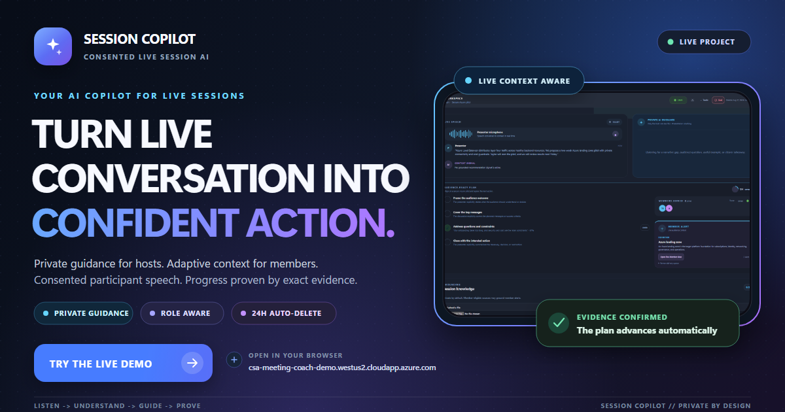
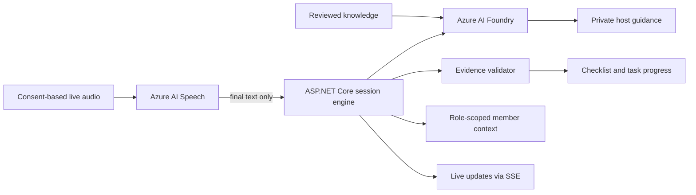

# Session Copilot

<p align="center">
  
</p>

<p align="center">
  <strong>Live, private AI guidance for hosts. Clear technical context for participants. Progress proven by transcript evidence.</strong>
</p>

<p align="center">
  <a href="https://csa-meeting-coach-demo.westus2.cloudapp.azure.com"><strong>Try the live demo</strong></a>
  ·
  <a href="#how-it-works">How it works</a>
  ·
  <a href="docs/engineering-reference.md">Engineering reference</a>
</p>

> **Hackathon status:** Session Copilot is currently a standalone web application.
> A Teams meeting side-panel and media-bot path are included as experimental
> integration work, but the live demo does not claim native Teams transcript access.

## The problem

Customer-facing professionals must listen, understand needs, explain technical
concepts, guide the discussion, track progress, and capture next actions at the
same time. This switching cost can produce missed signals, unclear follow-up, and
less attention for the people in the meeting.

Session Copilot keeps the host focused on the conversation while giving each role
only the support it needs.

| Host experience | Member experience |
|---|---|
| Private, context-aware next-step guidance | Plain-language definitions and contextual hints |
| Audience familiarity selected for the whole session | Beginner, familiar, or expert-level explanation depth |
| Recommendations that can become trackable tasks | No exposure to private host coaching |
| Evidence-backed progress against session outcomes | Approved, role-scoped content only |

## What makes it different

**The plan advances only when the conversation proves it.**

Session Copilot does not mark work complete because an AI model says a topic was
probably covered. Automatic completion requires:

1. a final transcript segment;
2. an exact quote from that segment;
3. independent deterministic validation;
4. the configured confidence threshold; and
5. for accepted recommendations, evidence that arrived after acceptance.

Every automatic completion remains visible, attributable, and reversible.

## How it works

1. **Configure the outcome** — the host selects a session type, objective,
   observable success criteria, audience familiarity, and optional trusted knowledge.
2. **Start with consent** — browser audio capture starts only after explicit user
   action and participant notice.
3. **Understand live context** — Azure AI Speech produces final text; raw audio is
   not stored by the application.
4. **Guide without taking control** — Azure AI Foundry or the deterministic local
   agent proposes grounded next steps that remain private to the host.
5. **Prove progress** — exact transcript evidence validates checklist items and
   accepted tasks before they can complete.

## Architecture



| Layer | Implementation |
|---|---|
| Experience | Standalone responsive web application; experimental Teams package |
| Runtime | ASP.NET Core on .NET 8 |
| Speech | Azure AI Speech with short-lived browser tokens |
| Reasoning | Azure AI Foundry declarative agent or deterministic local provider |
| Grounding | Reviewed File Search sources from [`knowledge`](knowledge/README.md) |
| Live updates | Server-Sent Events |
| State | Local JSON session store for the presentation demo |
| Deployment | Azure VM, Caddy HTTPS reverse proxy, GitHub Actions |

## Privacy and guardrails

- No emotion or sentiment recognition.
- No employee scoring, ranking, or manager surveillance.
- No hidden recording or automatic microphone start.
- Raw audio is not persisted by the application.
- Host guidance is never exposed in Member View.
- Audience familiarity applies to the session as a whole; it does not score or
  profile individual members.
- Session state, transcript text, join codes, and uploaded knowledge are temporary.
- In this prototype, session data is deleted automatically 24 hours after creation.
- Transcript content is treated as untrusted input, not as instructions to the agent.

The 24-hour period is a prototype retention setting, not a GDPR requirement.
Azure service logs and production retention policies must be assessed and
configured separately. This repository is an engineering MVP, not a compliance
certification.

## Current scope

| Capability | Status |
|---|---|
| Standalone live web demo | Available |
| Host and Member role separation | Implemented |
| Beginner, familiar, and expert member explanations | Implemented |
| Domain definitions grounded in member-eligible session documents | Implemented |
| Host and Member session restoration after refresh | Implemented |
| Consent-gated Host and Member microphones with server-side attribution | Implemented |
| Consent-based browser speech | Implemented |
| Private AI recommendations | Implemented |
| Evidence-backed checklist and tasks | Implemented |
| Temporary 24-hour local session retention | Implemented |
| Native Teams live transcript access | Not available through a public streaming API |
| Teams media bot | Experimental; requires tenant approvals and infrastructure |
| Production Entra identity and governance | Out of scope for this hackathon MVP |

## Run locally

Requirements: [.NET 8 SDK](https://dotnet.microsoft.com/download/dotnet/8.0).

```powershell
dotnet restore
dotnet run --project .\src\CsaMeetingCoach.Api --urls http://127.0.0.1:5055
```

Open `http://127.0.0.1:5055`. The default `Local` agent is deterministic and does
not require Azure credentials.

## Repository guide

| Path | Purpose |
|---|---|
| `src/CsaMeetingCoach.Api` | Web host, APIs, browser experience, session security |
| `src/CsaMeetingCoach.Core` | Coaching, evidence validation, session lifecycle |
| `src/CsaMeetingCoach.BotService` | Experimental Teams application-hosted media bot |
| `tests` | Unit and integration coverage |
| `knowledge` | Reviewed, non-secret grounding material for Foundry File Search |
| `tools` | Knowledge indexing and Custom Speech dataset utilities |
| `deploy` | Demo VM, Teams package, and Custom Speech automation |
| `appPackage` | Teams manifest and product branding |

### Why the `knowledge` folder is required

The folder is intentionally versioned. The manual `index-knowledge` workflow sends
these reviewed sources to a new Foundry vector store. The active vector-store ID is
configured separately, so a normal deployment does not re-index or upload the
folder. Removing it would break reproducible grounding updates and the associated
tests.

Only approved public or organizational material belongs there—never transcripts,
credentials, customer data, personal data, or content that conflicts with
sensitivity labels and retention rules.

## More detail

The [engineering reference](docs/engineering-reference.md) documents agent
providers, speech adaptation, the transcript adapter, experimental Teams
integration, deployment, and operational constraints.

## License

No open-source license has been granted for this repository. All rights are
reserved unless the repository owner states otherwise.
